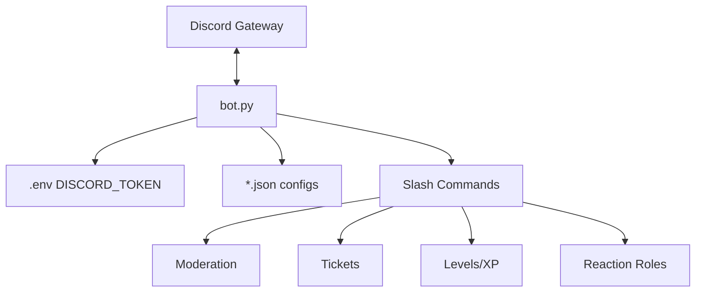

# Architecture — Discord Admin Bot

## Overview

Single-process Discord bot built on `discord.py` 2.x with slash commands and JSON-backed guild configuration.



## Structure

| Path | Purpose |
|------|---------|
| `bot.py` | Main bot (~2650 lines): events, commands, views |
| `requirements.txt` | `discord.py`, `python-dotenv` |
| `Procfile` | Heroku/Railway process definition |
| `*.json` | Per-guild persisted settings (empty `{}` by default) |

## Configuration Model

Each JSON file maps to a feature domain (e.g. `warnings.json`, `tickets.json`). Loaded at startup, written on changes.

## Command Categories

- **Moderation** — ban, kick, timeout, warn, clear
- **Roles** — assign, create, auto-role, reaction roles
- **Engagement** — XP/levels, giveaways, polls, reminders
- **Support** — ticket system with transcripts
- **Admin** — logging, verification, custom commands

## Deployment

```bash
pip install -r requirements.txt
echo "DISCORD_TOKEN=your_token" > .env
python bot.py
```

Or via `Procfile` on Railway/Heroku.

## Scaling Notes

- Single instance per bot token (Discord gateway limitation)
- JSON files are not suitable for multi-instance writes — use a database if horizontal scaling is needed

## License

Apache License 2.0 — see [LICENSE](LICENSE)
